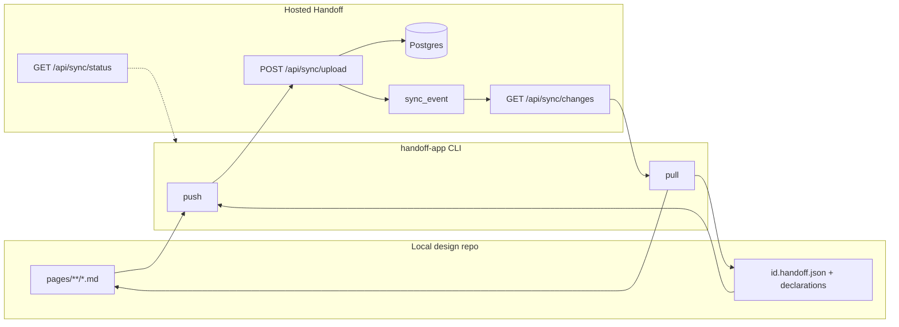

# Component sync with a hosted Handoff (current state)

How **local design-system repos** stay in sync with a **hosted Handoff** instance (Postgres-backed Next.js app) for **components**, **patterns**, and **markdown pages**.

## Single sync path: CLI push / pull

| Direction | Command | Transport |
|-----------|---------|-----------|
| Local → hosted | `handoff-app push` | `POST {origin}/api/sync/upload` with `Authorization: Bearer …` |
| Hosted → local | `handoff-app pull` | `GET {origin}/api/sync/changes?since=…` with the same bearer |

The hosted app stores authoritative data in **Postgres**; `sync_event` is the append-only ledger so pulls can replay history. There is **no** in-app “import from code” / “export to disk” flow—admins sync by running the CLI from a checkout. **Interactive developers** should run `handoff-app login` (device flow) once; **CI and automation** can keep using `HANDOFF_CLOUD_URL` + `HANDOFF_CLOUD_TOKEN` (or legacy `HANDOFF_SYNC_*`) matching the server’s `HANDOFF_SYNC_SECRET`.

### CLI authentication (device flow + legacy bearer)

1. **`handoff-app login`** — CLI calls `POST {origin}/api/oauth/device`, prints `verification_uri` and `user_code`; you approve in the browser at `{origin}/cli/device` (signed in). The CLI polls `POST {origin}/api/oauth/token` with `grant_type=urn:ietf:params:oauth:grant-type:device_code` and stores tokens under `.handoff/cli-auth.json`.
2. **`pull` / `push` / `sync-status`** — Bearer is taken from the stored access token first; if absent, from `HANDOFF_CLOUD_TOKEN` / `HANDOFF_SYNC_SECRET` (legacy).
3. **`handoff-app logout`** — Deletes `.handoff/cli-auth.json` for the resolved host.

In-app help: open **Develop locally** in the nav (when auth is enabled) → `/dev/local-setup`, or use the device consent page `/cli/device`.

### Environment variables

**On the server**

- `HANDOFF_SYNC_SECRET` — Legacy shared bearer for automation; still accepted by `/api/sync/*` alongside CLI JWTs.
- `HANDOFF_CLI_JWT_SECRET` (optional) — Dedicated secret for signing CLI access tokens. If unset, the app derives signing material from `AUTH_SECRET` for CLI JWTs only.
- JWT access tokens use audience `handoff-cli-sync` and issuer matching the deployment public origin. **Admin** users receive `sync:read` and `sync:write`; non-admins receive **`sync:read` only** (push returns **403** without write scope).

**On the developer machine** (`src/cli/sync/sync-remote-env.ts`):

| Preferred | Legacy alias |
|-----------|--------------|
| `HANDOFF_CLOUD_URL` | `HANDOFF_SYNC_URL` |
| `HANDOFF_CLOUD_TOKEN` | `HANDOFF_SYNC_SECRET` |

`handoff-app sync-status` uses the same URL and bearer resolution as push/pull.

### Push (`src/cli/sync/run-push.ts`)

1. **Default:** all `pages/**/*.md`, all `entries.components` ids with `{id}.handoff.json`, all `entries.patterns` ids with JSON.
2. **Selective:** `handoff-app push --components a b --patterns p --pages index guides/foo` pushes **only** the listed categories (each flag is optional; omitted categories are skipped when any selective flag is present). Unknown ids log a warning.
3. **`--dry-run`:** scans the same local inputs and prints counts (and per-change lines with `--debug`) without resolving cloud URL/token or calling the upload API.
4. **POST** body: `SyncUploadBody` in `src/types/handoff-sync.ts`. Server applies changes via `applyUploadedChange` in `src/app/lib/db/sync-queries.ts`.

### Pull (`src/cli/sync/run-pull.ts`, `apply-pull.ts`)

1. State: `.handoff/sync-state.json` (`remoteUrl`, `lastSyncVersion`, fingerprints).
2. Writes **`pages/`** and **`{id}.handoff.json`** under the working tree; conflicts go to `.handoff/conflicts/`.
3. **`--dry-run`:** still **GET**s `/api/sync/changes` (needs auth), runs the same apply logic in memory only—no files, conflict artifacts, or sync-state updates.
4. **Local SQLite:** pull is **files-only** today. After pull, run `handoff-app start` again (or your usual dev restart) so the embedded DB / merged provider picks up changes. Optional future improvement: upsert pulled payloads into `.handoff/local.db` from the CLI for instant dev-server refresh without coupling the CLI to the full Drizzle stack.

### Sync status

`handoff-app sync-status` → `GET …/api/sync/status` using the same remote URL and bearer resolution as push/pull (`getSyncBearerToken` / env fallback).

## Diagram

## Related reading

- HTTP API (components PATCH/build, etc.): [`docs/api.md`](api.md)
- CLI commands: [`docs/cli.md`](cli.md)
- Deployment / env: [`docs/DEPLOYMENT.md`](DEPLOYMENT.md)
