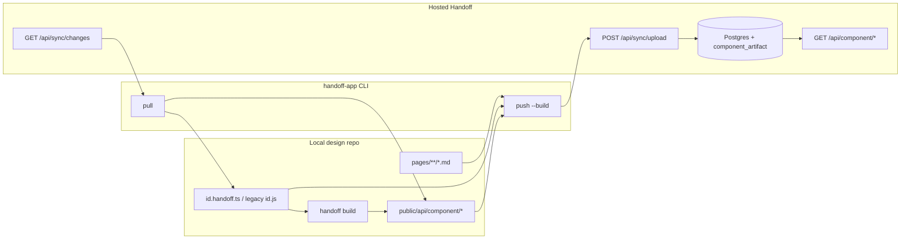

# Component sync with a hosted Handoff (current state)

How **local design-system repos** stay in sync with a **hosted Handoff** instance (Postgres-backed Next.js app) for **components**, **patterns**, and **markdown pages**.

## Single sync path: CLI push / pull

| Direction | Command | Transport |
|-----------|---------|-----------|
| Local → hosted | `handoff-app push` | `POST {origin}/api/sync/upload` with `Authorization: Bearer …` |
| Hosted → local | `handoff-app pull` | `GET {origin}/api/sync/changes?since=…` with the same bearer |

The hosted app stores authoritative data in **Postgres**; `sync_event` is the append-only ledger so pulls can replay history. **Interactive developers** should run `handoff-app login` (device flow) once; **CI** can use `HANDOFF_CLOUD_URL` + `HANDOFF_CLOUD_TOKEN` (or legacy `HANDOFF_SYNC_*`).

## Local builds + artifact sync (no server Vite)

Previews are **built on the developer machine** (where `node_modules`, design-system aliases, and `handoff.config` exist) and uploaded as **static artifacts** under `public/api/component/` — not compiled on Vercel.

| Artifact | Purpose |
|----------|---------|
| `{id}.json` | Catalog + preview metadata |
| `{id}.css`, `{id}.js` | Per-component assets |
| `{id}-{preview}.html` | iframe preview targets |

Hosted Handoff serves artifacts from **disk** (local dev / materialized deploy) or **`component_artifact`** Postgres rows (synced push) via `GET /api/component/[...path]`.

**Server-side component builds are retired.** `POST /api/handoff/components/build` returns **410**. Use `handoff-app push --build` (default when pushing components) or `handoff-app build:components && handoff-app push`.

### Push (`src/cli/sync/run-push.ts`)

1. **Declarations:** resolves `{id}.handoff.ts`, legacy `{id}.js`, or `{id}.handoff.json` via `resolveDeclarationForSync()` — evaluates TS/JS locally, never on the server.
2. **Payload:** `handoffConfig` (serializable declaration), normalized `data`, optional `buildArtifacts` map (basename → file contents).
3. **Flags:**
   - `--build` / default — run local component/pattern build before upload
   - `--metadata-only` — skip `buildArtifacts` (catalog/Figma/MCP only)
   - `--no-build` — skip build step; upload existing artifacts only
   - `--dry-run` — no network call
4. **Selective:** `--components`, `--patterns`, `--pages` (same as before).

### Pull (`apply-pull.ts`, `apply-declaration-pull.ts`)

1. State: `.handoff/sync-state.json` (fingerprints + cursor).
2. **Components/patterns:** writes or **patches** `{id}.handoff.ts` (metadata merge preserves imports and React component refs). New remote-only components get a **synthesized** stub using the project’s dominant renderer (`handlebars` / `react` / `csf`).
3. **Artifacts:** when `buildArtifacts` is in the sync payload, restores files under `public/api/component/` (and `public/api/pattern/` for patterns).
4. **Legacy:** if only `{id}.js` exists locally, pull creates `{id}.handoff.ts` and logs that modern declarations take precedence at runtime.
5. Conflicts → `.handoff/conflicts/` (local-wins fingerprinting).

Pull does **not** write `{id}.handoff.json` sidecars.

### CI recipe

```bash
handoff-app build:components
handoff-app push --components "$CHANGED_IDS"
```

Or a single command when pushing from a dev checkout: `handoff-app push --build`.

## Diagram



## Related reading

- HTTP API: [`docs/api.md`](api.md)
- CLI commands: [`docs/cli.md`](cli.md)
- Security (artifact serving): [`docs/SECURITY-COMPONENT-BUILDS.md`](SECURITY-COMPONENT-BUILDS.md)
- Deployment: [`docs/DEPLOYMENT.md`](DEPLOYMENT.md)
