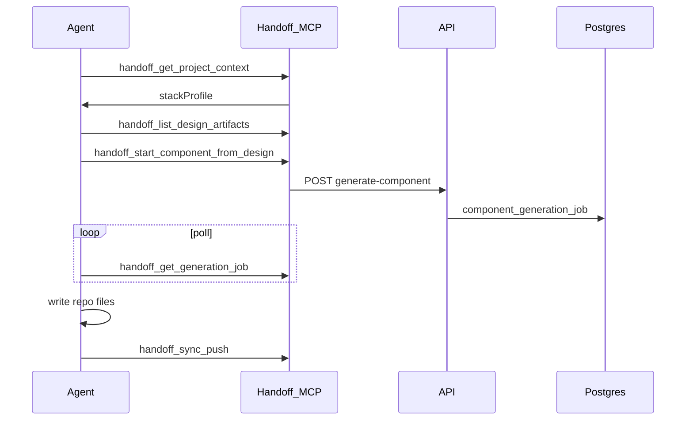

# Handoff MCP — RFC (v1)

Remote **SSE** MCP server on the hosted Handoff deployment (Postgres required). Included in hosted Handoff; not a separate product.

## Goals

- Expose design-system truth (reference, components, sync, design artifacts) to AI clients (Cursor, Claude Desktop, Claude Design).
- **Hydrate** sessions with per-project stack context (Bootstrap/Handlebars vs React/Tailwind).
- Reuse device OAuth + JWT; same bearer as CLI sync where scopes overlap.
- Complement **Figma MCP** (Handoff does not embed Figma).

## Transport

- **Streamable HTTP / SSE** at `{origin}/api/mcp` on the hosted app.
- Clients connect to `HANDOFF_CLOUD_URL`, not `localhost`.
- Local `handoff-app start` without Postgres does not serve MCP; configure MCP client with team origin.

## Authentication

### Device flow (interactive)

Same as CLI:

1. `POST /api/oauth/device` → `device_code`, `user_code`, `verification_uri`
2. User approves at `/cli/device`
3. `POST /api/oauth/token` with `grant_type=urn:ietf:params:oauth:grant-type:device_code`
4. Use `access_token` as `Authorization: Bearer` on MCP requests

### Scopes (JWT claim `scp`, space-separated)

| Scope | Allows |
|-------|--------|
| `sync:read` | `handoff_sync_status`, `handoff_sync_pull` |
| `sync:write` | `handoff_sync_push` (admin or legacy secret) |
| `reference:read` | `handoff_get_reference`, `handoff_get_stack_guide` |
| `components:read` | `handoff_search_components`, `handoff_get_component`, `handoff_get_tokens` |
| `components:write` | `handoff_patch_component`, `handoff_enqueue_build` |
| `design:read` | `handoff_list_design_artifacts`, `handoff_get_design_artifact` |
| `design:write` | `handoff_create_design_artifact`, `handoff_extract_design_assets` |
| `generate:component` | `handoff_start_component_from_design`, `handoff_get_generation_job` |
| `figma:sync` | `handoff_figma_list_components`, `handoff_figma_sync_properties` |

**Admin** device login receives all scopes. **Member** receives read scopes + `design:write` (configurable).

**Legacy:** `HANDOFF_SYNC_SECRET` bearer accepted for automation (`sync:*` only).

### JWT audience

Tokens accept audience `handoff-api` (preferred) or legacy `handoff-cli-sync`.

## Project hydration

### Config (`handoff.config.js`)

```ts
projectProfile: {
  name: 'ssc',
  stackProfile: 'bootstrap-handlebars', // | 'react-tailwind' | 'react-scss'
  figmaFileKey: '0gKWw8gYChpItKWzh8o23N',
  paths: {
    components: ['./handoff/integration/components'],
    patterns: [],
    pages: ['./handoff/pages'],
  },
}
```

### Tools

| Tool | Description |
|------|-------------|
| `handoff_get_project_context` | Merged profile: `stackProfile`, paths, Figma key, remote URL, sync cursor hint |
| `handoff_get_stack_guide` | Markdown rules for active stack (template language, CSS, property shapes) |
| `handoff_get_reference` | `catalog` \| `tokens` \| `icons` \| `property-patterns` (generated in **Admin → Reference**) |
| `handoff_get_design_guidelines` | Team **Design.MD** from **Design → Settings** (Postgres `handoff_design_workspace`) |
| `handoff_get_brand_voice` | Brand voice fields as JSON + formatted markdown |
| `handoff_get_component_reference` | Reference image for `buttons` \| `inputs` \| `iconography` (`design:read`) |

Server default: `HANDOFF_DEFAULT_STACK_PROFILE` env when client omits profile.

**Reference maintenance:** Materials are regenerated from the live catalog (not copied from repo `handoff/reference/*.md`). After deploy or large catalog changes, run **Admin → Reference → Regenerate all** so MCP `handoff_get_reference` returns current content.

**Design workspace:** Admins save Design.MD, brand voice, and component reference images under **Design → Settings**. The same data powers the design workbench LLM, component-generation jobs, and MCP tools above.

## Tools (Phase 1)

### Read

- `handoff_get_project_context` — `{ projectName?, stackProfile? }`
- `handoff_get_reference` — `{ id: 'catalog' | 'tokens' | 'icons' | 'property-patterns' }`
- `handoff_get_stack_guide` — `{ stackProfile? }`
- `handoff_search_components` — `{ query?, group?, limit? }`
- `handoff_get_component` — `{ id }`
- `handoff_get_tokens` — `{}`
- `handoff_get_design_guidelines` — `{}`
- `handoff_get_brand_voice` — `{}`
- `handoff_get_component_reference` — `{ slot: 'buttons' | 'inputs' | 'iconography' }`

### Sync

- `handoff_sync_status` — `{}`
- `handoff_sync_pull` — `{ since?: number }` → `{ changes: SyncChange[] }`
- `handoff_sync_push` — `{ changes: SyncUploadBody }` (requires `sync:write`)

### Components

- `handoff_patch_component` — partial patch body (requires `components:write`, admin)
- `handoff_enqueue_build` — `{ componentId }` (requires `components:write`, admin)

### Design library → component

- `handoff_list_design_artifacts` — `{ status?, limit? }`
- `handoff_get_design_artifact` — `{ id }`
- `handoff_create_design_artifact` — `{ title?, description?, imageBase64, ... }` (max ~8MB)
- `handoff_start_component_from_design` — `{ artifactId, componentName, renderer?, ... }`
- `handoff_get_generation_job` — `{ jobId }`

### Figma (optional v1)

- `handoff_figma_list_components` — `{}`
- `handoff_figma_sync_properties` — plugin contract payload (Phase 3)

## Resources (URIs)

| URI | Content |
|-----|---------|
| `handoff://reference/{id}` | Generated reference markdown |
| `handoff://stack-guide/{profile}` | Stack authoring guide |
| `handoff://project/context` | Hydration JSON |
| `handoff://component/{id}` | Component row JSON |
| `handoff://design/{id}` | Artifact metadata |

## Sequences

### Design → component (developer)



### Figma → Handoff component (with Figma MCP)

1. `handoff_get_project_context` + `handoff_get_stack_guide`
2. `handoff_get_reference` (catalog, property-patterns, tokens, icons)
3. `handoff_get_design_guidelines` + `handoff_get_brand_voice` (+ optional `handoff_get_component_reference`)
4. Figma MCP: `get_design_context`, `get_screenshot`
5. Agent writes component files locally
6. `handoff_sync_push` or `handoff_patch_component` + `handoff_enqueue_build`

## REST alignment

MCP tools call the same logic as existing routes under `/api/handoff/*` and `/api/sync/*`. Reference materials: `GET /api/handoff/reference-materials` (MCP-scoped JWT, not admin-only).

## Cursor configuration (example)

```json
{
  "mcpServers": {
    "handoff": {
      "url": "https://your-team.handoff.example.com/api/mcp",
      "headers": {
        "Authorization": "Bearer <access_token from device flow>"
      }
    }
  }
}
```

## Phasing

| Phase | Deliverable |
|-------|-------------|
| 0 | This RFC + SQLITE-REMOVAL-ADR |
| 1 | SSE route, auth, Phase 1 tools |
| 2 | Drop SQLite, hybrid local, capabilities |
| 3 | Figma sync tools, ETag, project config table |

## Open items (post-v1)

- `handoff_project_config` DB table for hydration without full sync push
- Rate limits per user via `handoff_event_log`
- Multi-tenant org scoping
