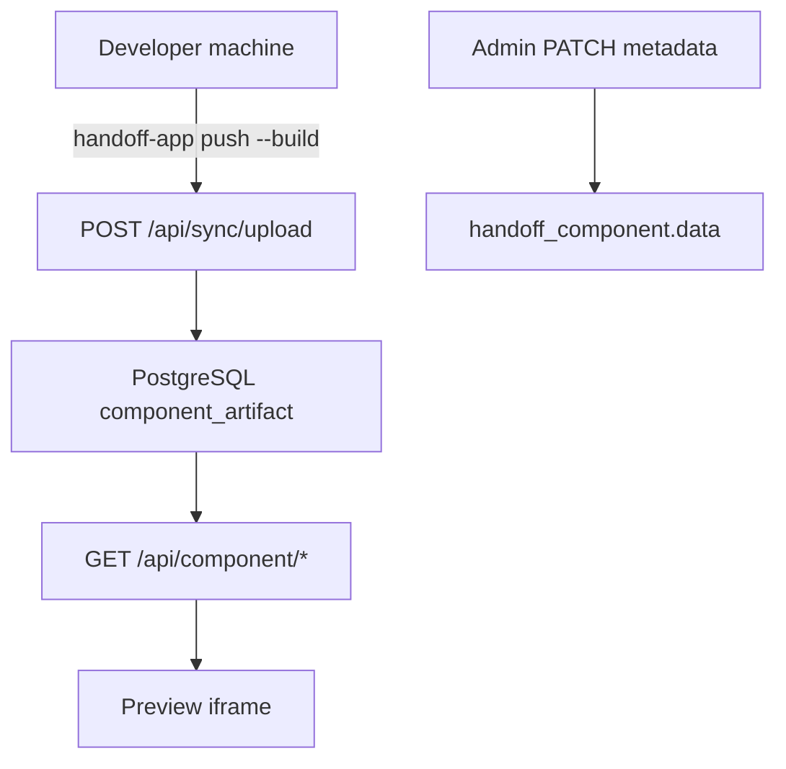

# Security: Component previews & dynamic editing

Threat model for **database-backed components** in the hosted Handoff app.

## Architecture (current)

**Server-side Vite builds are retired.** Previews reach hosted Handoff via CLI sync:

1. Developers build locally (`handoff-app build:components` or `push --build`).
2. Static artifacts (`public/api/component/*`) upload to Postgres (`component_artifact`) on push.
3. Hosted app serves artifacts via `GET /api/component/[...path]` (disk first, then DB).

## Threat catalog

| Threat | Mitigation |
|--------|------------|
| **Arbitrary code execution on server** | No server compile path; builds run on trusted dev/CI machines only |
| **XSS (preview)** | iframe sandbox; same-origin previews from synced artifact bundle |
| **IDOR on PATCH** | Admin role required for component PATCH |
| **Path traversal on artifact serve** | Filename validation; no `..` in route |
| **DoS via huge push payloads** | CLI size guard (warn 2MB, reject 10MB per component bundle) |

## Legacy

`POST /api/handoff/components/build` returns **410 Gone**. The `component_build_job` table remains for historical rows only.

## References

- Artifact serve: [`src/app/app/api/component/[...path]/route.ts`](../src/app/app/api/component/[...path]/route.ts)
- Sync apply: [`src/app/lib/db/sync-queries.ts`](../src/app/lib/db/sync-queries.ts)
- CLI push: [`src/cli/sync/run-push.ts`](../src/cli/sync/run-push.ts)
