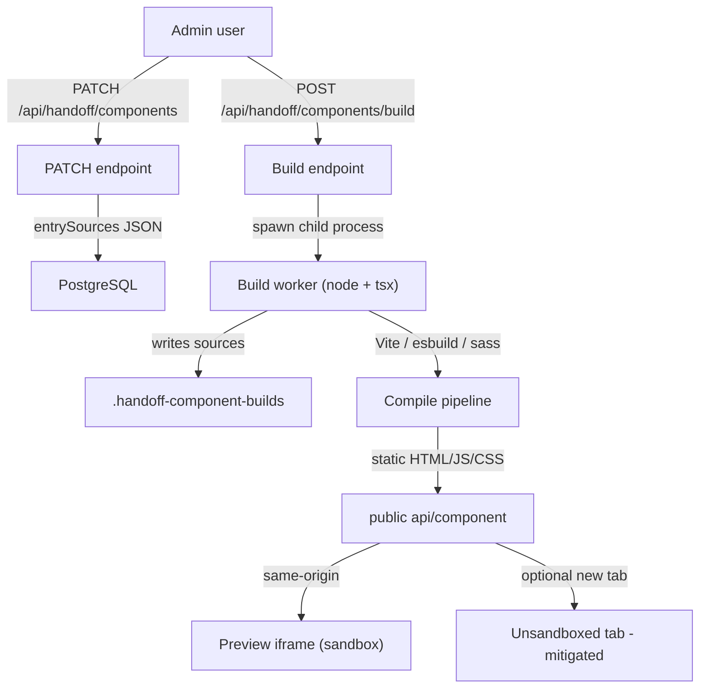

# Security: Component Builds & Dynamic Editing

This document records the threat model for **database-backed components** in the full Next.js Handoff app, where authenticated users can edit source, trigger Vite builds, and view previews.

## Architecture (attack surface)

## Threat catalog

| Threat | Description | MVP mitigation |
|--------|-------------|----------------|
| **Arbitrary code execution** | User TS/JS/HBS is compiled and executed at build time with server privileges. | Admin-only PATCH/build; stripped worker `env`; **future: containerized builds** |
| **Secret leakage** | Malicious build code could read `process.env` or filesystem. | Worker receives **allowlisted env vars** only |
| **IDOR** | Any logged-in user could PATCH or build any component. | **Admin role** required for API + server actions |
| **Path traversal** | Malicious `component_id` could escape build directories. | **Strict slug** regex + max length on create |
| **XSS (preview)** | Built HTML runs in browser; iframe sandbox limits parent access. | **Hide “Open in new tab”** for DB-backed previews (unsandboxed same-origin) |
| **DoS** | Flood build queue or huge payloads. | **Rate limit** builds per user; **cap** concurrent queued+building jobs |

## Current mitigations (baseline)

- Build runs in a **separate child process** (does not block the Next.js event loop; limits blast radius vs in-process `eval`).
- Preview iframe uses **`sandbox="allow-scripts"`** (no `allow-same-origin`), reducing cookie/session theft from malicious preview scripts in the embedded case.

## Gaps addressed by MVP hardening

1. **RBAC**: `PATCH` `/api/handoff/components`, `GET`/`POST` `/api/handoff/components/build`, and server actions `createComponent` / `updateComponent` / `deleteComponent` require `session.user.role === 'admin'`. `GET` `/api/handoff/components?id=` remains **any authenticated user** so viewers can load component pages (full row may include sources; tighten later with a public projection if needed).
2. **Env stripping**: Worker spawn uses an explicit allowlist (`DATABASE_URL`, `NODE_ENV`, `PATH`, `HOME`, `HANDOFF_APP_BASE_PATH`, `HANDOFF_COMPONENT_BUILD_REPO_ROOT`, `TZ`).
3. **Component IDs**: Only slugs matching `^[a-z0-9][a-z0-9-]{0,127}$` (1–128 chars) may be created.
4. **XSS escape hatch**: “Open in new tab” is hidden for DB-backed previews in the full server app.
5. **Rate limits**: Per-user POST limit (e.g. 5/minute) and global cap on `queued` + `building` jobs before accepting new builds.

## Future phase: containerized builds

**Goal:** Run the Handoff/Vite build in an **isolated environment** with:

- No access to production secrets (dedicated build identity / short-lived tokens only).
- **Network egress** disabled or allowlisted.
- **Read-only** source mount + writable scratch only.
- Resource limits (CPU, memory, wall time).

Until then, treat **admin** as a trusted role: anyone with admin can still run arbitrary code at build time inside the worker; MVP controls reduce exposure for non-admins and shrink accidental secret exposure.

## References

- Worker: [`src/app/lib/server/component-build-worker.ts`](../src/app/lib/server/component-build-worker.ts)
- Spawn: [`src/app/lib/server/component-builder.ts`](../src/app/lib/server/component-builder.ts)
- APIs: [`src/app/app/api/handoff/components/route.ts`](../src/app/app/api/handoff/components/route.ts), [`src/app/app/api/handoff/components/build/route.ts`](../src/app/app/api/handoff/components/build/route.ts)
