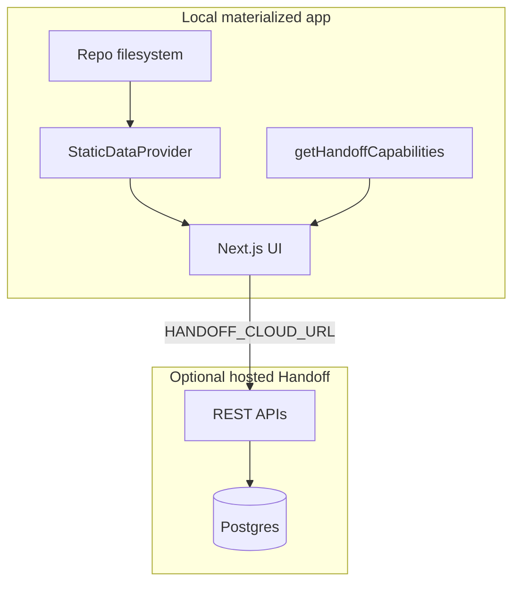

# ADR: Remove embedded SQLite — hybrid local development

**Status:** Accepted (implementation in progress)  
**Date:** 2026-05-21

## Context

Handoff 2.0 introduced dual storage: filesystem declarations plus an embedded SQLite database at `.handoff/local.db` when `DATABASE_URL` is unset. That enabled a “zero config” solo mode with synthetic admin sessions and DB overlays on disk-backed components.

In practice this created:

- Two sources of truth (git vs `.handoff/local.db`)
- Divergent code paths (`usePostgres()` / `useSqlite()`, two Drizzle schemas, bootstrap DDL)
- Confusion for team workflows (SSC already uses `HANDOFF_CLOUD_URL` for AI and sync)

## Decision

1. **Remove embedded SQLite entirely** from `handoff-app`.
2. **Hosted deployments (Vercel)** require `DATABASE_URL` (Postgres) — full feature set.
3. **Local `handoff-app start`** uses a **hybrid model**:
   - **Filesystem** for docs, components, patterns, tokens, and built previews.
   - **Remote API** (`HANDOFF_CLOUD_URL` + bearer) for team state, AI, job queues, and design library.
4. When remote is not configured, **do not fail startup** — disable features that require the cloud.

## Architecture

## Capability matrix

| Feature | Local filesystem | Requires remote API |
|---------|------------------|---------------------|
| Doc site, component previews, foundations | Yes | No |
| CLI `fetch`, local Vite build → `public/api` | Yes | No |
| CLI `push` / `pull` / `sync-status` | — | Yes (CLI calls remote directly) |
| Design workbench, design library | No | Yes |
| AI generate design / pattern / component | No | Yes |
| Admin build job log, AI cost, event log | No | Yes |
| User admin, invites, password reset | No | Yes (hosted only) |
| Figma OAuth GUI fetch | No | Yes |
| In-app DB component create/edit | No | Yes (prefer file edit + push) |
| MCP tools | — | Yes (connect to hosted origin) |

### Detection

- `hasRemoteApi`: `HANDOFF_CLOUD_URL` is set
- `hasRemoteAuth`: device login token or `HANDOFF_CLOUD_TOKEN`
- `remoteReachable`: optional cached health check to `{origin}/api/sync/status`

### UX when disabled

- Nav entries hidden or locked with link to `/dev/local-setup`
- Cloud-only pages show setup instructions
- API routes return `503` with `{ error, code: 'REMOTE_REQUIRED' }`

## Implementation notes

| Area | Change |
|------|--------|
| [`src/app/lib/db/index.ts`](../src/app/lib/db/index.ts) | Postgres only; throw clear error if `DATABASE_URL` missing when DB required |
| [`src/app/lib/data/`](../src/app/lib/data/) | `getDataProvider()` → `DynamicDataProvider` if Postgres, else `HybridDataProvider` (static only) |
| [`src/app/lib/handoff-capabilities.ts`](../src/app/lib/handoff-capabilities.ts) | Central feature flags |
| [`src/app/lib/remote-handoff-client.ts`](../src/app/lib/remote-handoff-client.ts) | Proxy cloud APIs from local Next server |
| SQLite artifacts | Remove `schema-sqlite.ts`, `sqlite-bootstrap.ts`, `migrations-sqlite/`, `better-sqlite3` usage in app |
| Auth | No synthetic admin; local without Postgres = open docs, no sign-in |
| Docs | README, `.env.example` — local = files + optional `HANDOFF_CLOUD_URL` |

## Migration

1. Delete `.handoff/local.db` if present (safe; data should be in git or remote).
2. Set `HANDOFF_CLOUD_URL` to your team Handoff origin.
3. Run `handoff-app login` or set `HANDOFF_CLOUD_TOKEN`.
4. For hosted Vercel: keep `DATABASE_URL` + `AUTH_SECRET`.

## Consequences

**Positive:** Simpler mental model (code on disk, team state in cloud), fewer bugs from dialect drift, MCP and sync align on one Postgres store.

**Negative:** Solo devs cannot use design library / AI without a hosted instance (or local Postgres via `DATABASE_URL`). Acceptable: product targets team Handoff on Vercel with optional cloud URL for local docs.

## Related

- [HANDOFF-MCP-RFC.md](./HANDOFF-MCP-RFC.md)
- [COMPONENT_SYNC_CURRENT_STATE.md](./COMPONENT_SYNC_CURRENT_STATE.md)
